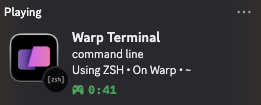

# Warp Discord Rich Presence (macOS)

Show your **Warp Terminal** activity on Discord with custom text, icons, buttons, and a **Focus Mode** for specific folders — **no client mods**, fully TOS‑friendly.

<p align="center">
  
  <br>
  <a href="https://discord.com/developers/docs/intro">Discord Developer Docs</a>
</p>

---

## Features

* Detects when **Warp.app** is running (by real app path) and clears presence when closed
* Rich Presence: `details`, `state`, **large/small icons**, elapsed `start` time, **buttons**
* **Focus Mode**: override texts/icons/buttons for matched folders (glob; e.g., company repos)
* Auto‑reconnect to Discord when the client restarts
* Optional `launchd` agent to auto‑run on login (with logs)

> macOS only. Tested on Apple Silicon. Not affiliated with Warp or Discord.

---

## Table of Contents

* [Quick Start](#quick-start)
* [Create a Discord Application & Upload Assets](#create-a-discord-application--upload-assets)
* [Shell Status Writer (zsh)](#shell-status-writer-zsh)
* [Run the Script](#run-the-script)
* [Focus Mode](#focus-mode)
* [Auto‑run on Login (launchd)](#auto-run-on-login-launchd)
* [Customization](#customization)
* [Troubleshooting](#troubleshooting)
* [Security & TOS](#security--tos)
* [Project Structure](#project-structure)
* [License](#license)

---

## Quick Start

```bash
# 1) Clone & install
python3 -m venv .venv
./.venv/bin/pip install -r requirements.txt

# 2) Set your Discord Application ID (see next section)
export DISCORD_CLIENT_ID=YOUR_APP_ID

# 3) Ensure Discord Desktop is running
#    User Settings → Activity Privacy → enable "Display current activity..."
#    Remove Warp from Registered Games (to avoid Game Detection overriding RPC)

# 4) Configure your shell to write status (zsh snippet below)

# 5) Run
./.venv/bin/python3 warp_discord_presence.py
```

If everything is set up, your Discord profile should update within a few seconds.

---

## Create a Discord Application & Upload Assets

1. Open **Discord Developer Portal** → **New Application**
2. Copy your **Application ID** (keep it private; use the `DISCORD_CLIENT_ID` env var)
3. Go to **Rich Presence → Art Assets** and upload icons:

   * **Large icon** key (e.g., `warp`) — recommend 512×512 or 1024×1024 PNG
   * (Optional) **Small icon** keys for shell logos: `zsh`, `bash`, `fish`

**Notes**

* Asset **keys are lowercase**; file extensions are stripped (e.g., `Warp.png` → key `warp`).
* New assets can take **1–5 minutes** to propagate. Restart Discord if needed.

---

## Shell Status Writer (zsh)

The script reads your current working directory and git branch from a tiny JSON file that your shell updates on each prompt.

Append the following to your `~/.zshrc`:

```bash
export RPC_STATUS_FILE="$HOME/.local/share/discord_rpc/status.json"

precmd() {
  mkdir -p "$(dirname "$RPC_STATUS_FILE")"
  local cwd="$PWD"
  local branch=""
  if command -v git >/dev/null 2>&1 && git rev-parse --is-inside-work-tree >/dev/null 2>&1; then
    branch="$(git rev-parse --abbrev-ref HEAD 2>/dev/null)"
  fi
  /usr/bin/printf '{ "cwd": "%s", "branch": "%s", "ts": %s }\n' \
    "$(printf '%s' "$cwd"   | sed 's/\"/\\\"/g')" \
    "$(printf '%s' "$branch"| sed 's/\"/\\\"/g')" \
    "$(date +%s)" > "$RPC_STATUS_FILE"
}
```

Open a new Warp tab or `source ~/.zshrc`, then verify the file is being written:

```bash
cat ~/.local/share/discord_rpc/status.json
```

---

## Run the Script

* Set the Application ID via environment variable (recommended):

```bash
export DISCORD_CLIENT_ID=YOUR_APP_ID
./.venv/bin/python3 warp_discord_presence.py
```

* Or edit the constant inside `warp_discord_presence.py`:

```python
CLIENT_ID = os.environ.get("DISCORD_CLIENT_ID", "YOUR_DISCORD_APP_ID")
```

**Discord client settings**

* Use **Discord Desktop** (not the web app)
* User Settings → **Activity Privacy** → enable **Display current activity…**
* Remove **Warp** from **Registered Games** (prevents Game Detection from overriding Rich Presence)

---

## Focus Mode

Override texts/icons/buttons when your `cwd` matches certain folders.

Create `~/.config/warp_rpc/focus.json`:

```json
{
  "rules": [
    {
      "name": "Company Work",
      "match": ["~/work/*", "/Users/you/gitrepo/company/*"],
      "details": "Focus • Company",
      "state": "In {cwd_short} • git:{branch}",
      "large_image": "warp",
      "small_image": "zsh",
      "buttons": [{ "label": "Docs", "url": "https://intranet.example.com" }],
      "reset_timer_on_enter": true
    },
    {
      "name": "Default for gitrepo",
      "match": ["/Users/you/gitrepo/*", "~/gitrepo/*"],
      "details": "Focus • Dev",
      "state": "{cwd_short} • git:{branch}",
      "large_image": "warp",
      "small_image": "zsh"
    }
  ]
}
```

* Variables: `{cwd}`, `{cwd_short}`, `{branch}`, `{shell}`
* `match` supports `~` and glob (`*`). The first matching rule wins.
* The script re‑reads this file periodically (no reload required). Set `CHECK_EVERY` to 3–5s for snappier updates.

**Advanced**: point to a project‑local config via env var

```bash
export FOCUS_CFG="/path/to/repo/focus.json"
```

(You can also symlink `~/.config/warp_rpc/focus.json` to a file inside your repo.)

---

## Auto‑run on Login (launchd)

Use a LaunchAgent so the script runs in the background after login.

Create `~/Library/LaunchAgents/com.example.warp-rpc.plist`:

```xml
<?xml version="1.0" encoding="UTF-8"?>
<!DOCTYPE plist PUBLIC "-//Apple//DTD PLIST 1.0//EN"
 "http://www.apple.com/DTDs/PropertyList-1.0.dtd">
<plist version="1.0">
  <dict>
    <key>Label</key><string>com.example.warp-rpc</string>
    <key>ProgramArguments</key>
    <array>
      <string>/Users/you/path/warp-discord-presence/.venv/bin/python3</string>
      <string>/Users/you/path/warp-discord-presence/warp_discord_presence.py</string>
    </array>
    <key>WorkingDirectory</key>
    <string>/Users/you/path/warp-discord-presence</string>
    <key>RunAtLoad</key><true/>
    <key>KeepAlive</key><true/>
    <key>StandardOutPath</key><string>/tmp/warp-rpc.out</string>
    <key>StandardErrorPath</key><string>/tmp/warp-rpc.err</string>
  </dict>
</plist>
```

Load/reload & inspect logs:

```bash
launchctl unload ~/Library/LaunchAgents/com.example.warp-rpc.plist 2>/dev/null || true
launchctl load -w  ~/Library/LaunchAgents/com.example.warp-rpc.plist
launchctl list | grep warp-rpc

# Logs
tail -f /tmp/warp-rpc.out /tmp/warp-rpc.err
```

> **Important**: Point `ProgramArguments[0]` to your **venv** Python (e.g., `.../.venv/bin/python3`) to avoid `ModuleNotFoundError` under launchd.

---

## Customization

* **Icons**

  * `large_image` is typically the Warp logo (`warp`)
  * `small_image` can be your shell logo (upload keys `zsh`, `bash`, `fish`)
* **Buttons** (max 2; http/https only)

  ```python
  buttons=[
    {"label": "Warp", "url": "https://warp.dev"},
    {"label": "Repo", "url": "https://github.com/you/yourrepo"},
  ]
  ```
* **Texts**

  * `details` = top line; `state` = bottom line; keep concise (< \~120 chars)
* **Elapsed timer**

  * The script uses `start` and **resets** when you switch folders/branches or enter a new Focus rule.
* **Warp path marker**

  * We detect Warp by checking executable/cmdline contains `"/Applications/Warp.app/"` (case‑insensitive). If Warp is installed elsewhere, update `WARP_PATH_MARKER` accordingly.
* **Polling interval**

  * `CHECK_EVERY = 3–5` is a good balance. Lower intervals update faster but can spam IPC.

---

## Troubleshooting

* **Shows “Playing Warp ?”**

  * That’s **Game Detection**. Remove Warp from **Registered Games** and restart Discord.
* **Asset not showing / wrong icon**

  * Asset key must be **lowercase** and match exactly (`large_image="warp"`). Allow a few minutes for cache; restart Discord.
* **`ModuleNotFoundError: psutil` (under launchd)**

  * Your LaunchAgent is running `/usr/bin/python3`. Point it to `.venv/bin/python3`.
* **`PipeClosed` / Broken pipe**

  * Happens when Discord restarts. The script auto‑reconnects; no action needed.
* **Presence doesn’t clear after closing Warp**

  * We check the real app path to avoid false positives. Reduce `CHECK_EVERY` to 3s for quicker clearing.
* **No updates when switching folders**

  * Ensure your `~/.zshrc` hook writes to `~/.local/share/discord_rpc/status.json` (press Enter or `cd` to trigger). Verify with `cat`.
* **Debug which rule matched**

  * Add a temporary print after matching: `print("[*] Focus rule matched:", rule.get("name"))`.

---

## Project Structure

```
warp-discord-presence/
├─ README.md
├─ requirements.txt
├─ warp_discord_presence.py
├─ examples/
│  ├─ focus.json
│  └─ com.example.warp-rpc.plist
├─ docs/
│  └─ screenshot.png
├─ .github/
│  └─ ISSUE_TEMPLATE/
│     ├─ bug_report.yml
│     └─ feature_request.yml
├─ .gitignore
└─ LICENSE
```

**`.gitignore`** (excerpt)

```
.venv/
__pycache__/
*.pyc
.DS_Store
.env*
/tmp/
```

**`requirements.txt`**

```
pypresence>=4.3.0
psutil>=5.9.0
```

---

## Security & TOS

* No client modification and no self‑botting — uses public desktop IPC.
* Not affiliated with Warp or Discord.
* Avoid committing sensitive IDs; prefer the `DISCORD_CLIENT_ID` env var.

---

## License

MIT. See [LICENSE](./LICENSE).

---

## Acknowledgments

* [`pypresence`](https://github.com/qwertyquerty/pypresence)
* Warp team for a great terminal ❤️
